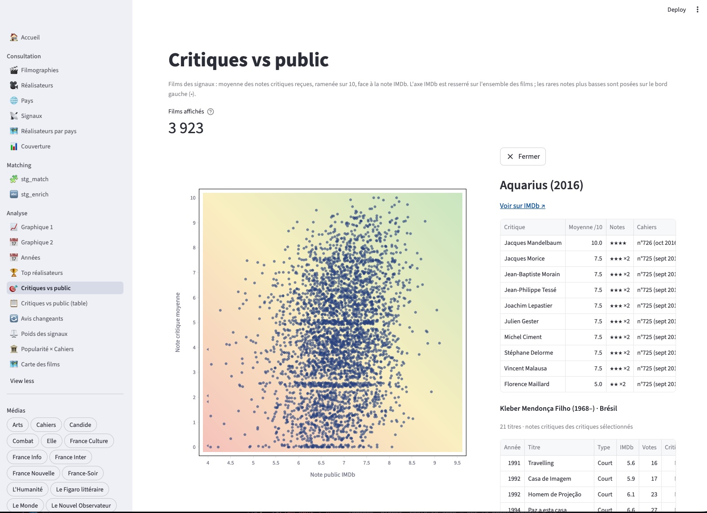
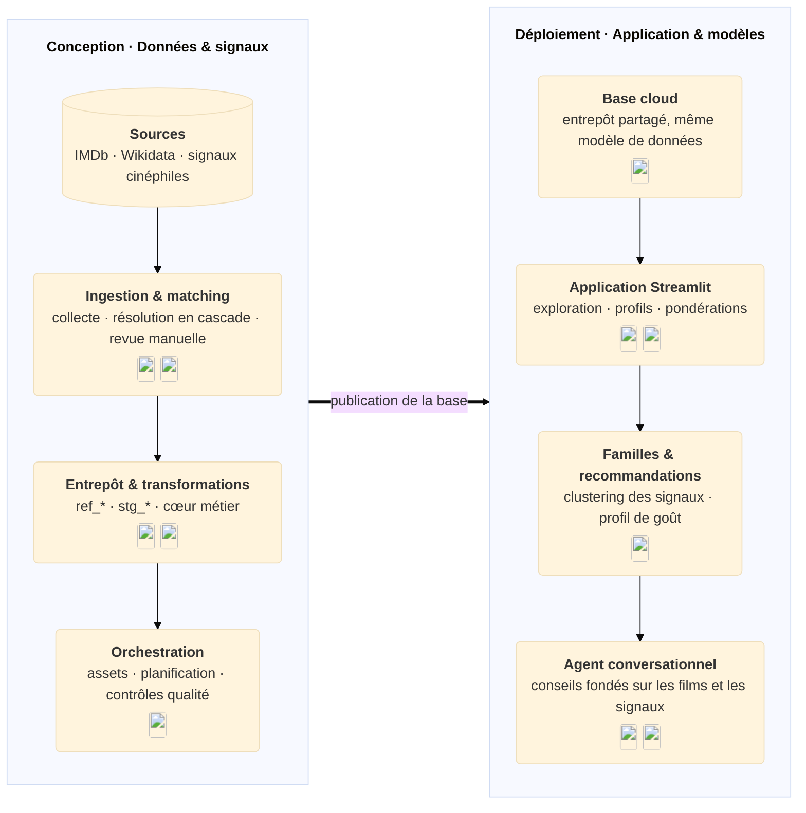
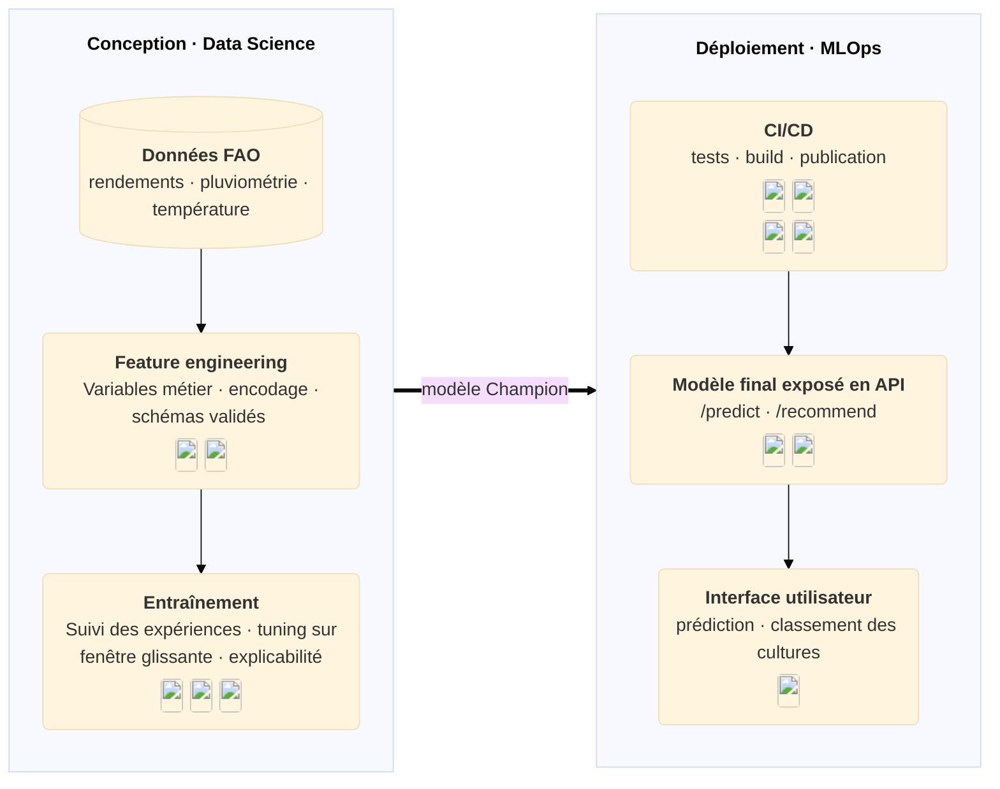
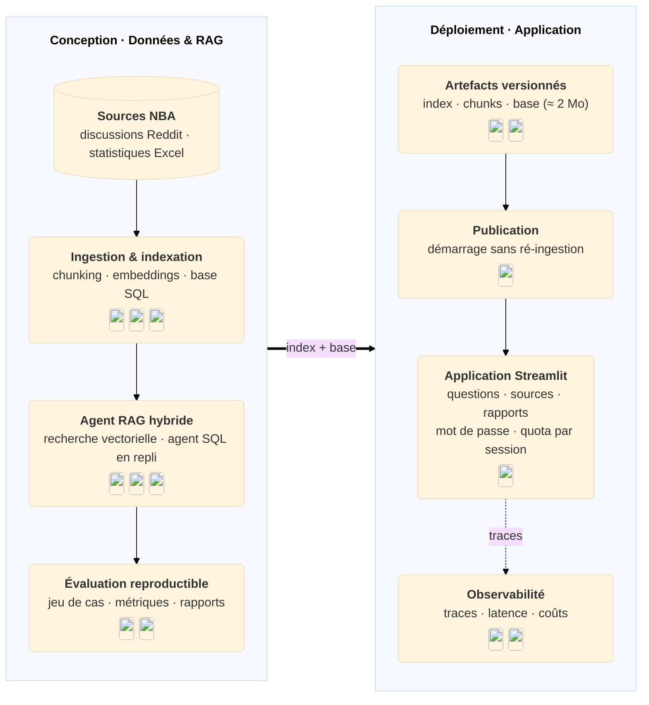
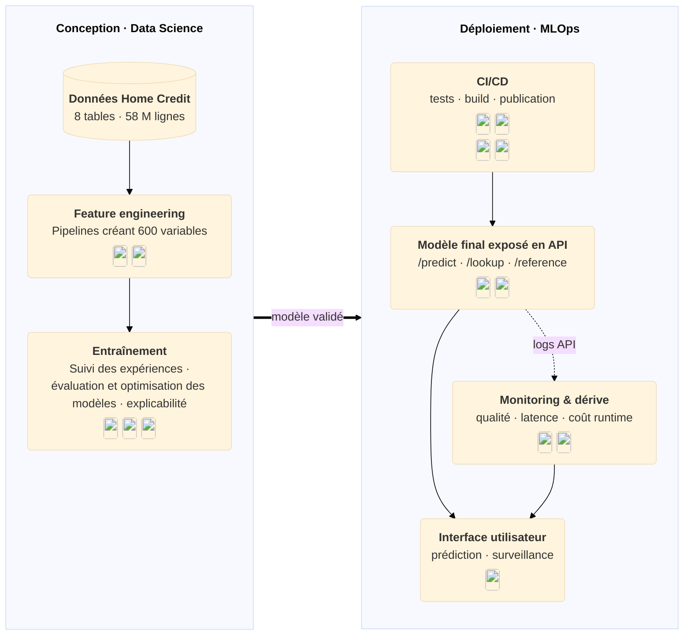

# Applications data & IA que j'ai développées

Quatre projets de bout en bout, de la préparation des données au déploiement : modélisation, industrialisation MLOps, applications LLM et suivi en production.

---

## :lucide-clapperboard: &nbsp; Suggestion de films

Cette application enrichit la base de référence **IMDb** de la fréquentation en salles et de **références cinéphiles soigneusement sélectionnées** : notes des Cahiers du cinéma, sélections de certains festivals, listes personnelles... Elle permet d'explorer l'histoire du cinéma à travers ces regards, de découvrir des **familles de cinéastes**, de recevoir des **recommandations personnalisées** et d'être **conseillé en langage naturel sur tout le catalogue**.

- Enrichissement automatisé de la base : IMDb, références cinéphiles
- Exploration par cinéastes, régions, périodes, listes
- Comparaison critiques et public
- Profil cinéphile et recommandations à partir de films préférés
- Conseils en langage naturel par un agent conversationnel, justifiés par les signaux

*Lien vers l'application à venir*

<strong>Architecture de la solution</strong>

Côté données, dlt collecte IMDb, Wikidata et les signaux cinéphiles, puis les cas ambigus sont résolus par une cascade de règles et une revue manuelle. dbt transforme ensuite les référentiels bruts et les zones de staging en un cœur métier où tous les signaux partagent le même modèle : un agent (critique, festival, cinéaste…) applique une valeur à un film ou à un cinéaste. Dagster orchestre l'ensemble et contrôle la qualité à chaque exécution.

Côté application, l'entrepôt est publié sur MotherDuck et alimente l'interface Streamlit, qui permet d'explorer l'histoire du cinéma à travers ces regards. Un clustering des signaux dégage des familles de cinéastes, et la recommandation pondère les signaux selon le profil de l'utilisateur. Un agent conversationnel conseille des films en s'appuyant sur la base et sur ces signaux.

Pour plus de détails, retrouvez la documentation technique (à venir) et le code (à venir) du projet.

---

## :lucide-wheat: &nbsp; Prévision agricole

À destination des acteurs agricoles, cette application **prédit le rendement d'une culture** et **classe les cultures les plus adaptées** dans un contexte donné (zone, année, pluviométrie, pesticides, température). Entraîné sur des données de la *Food and Agriculture Organization* des années passées, le modèle prédit l'année suivante avec une très bonne précision.

**Parcours utilisateur**

- Choix de la zone, de la culture et de l'année
- Réglage des conditions (pluviométrie, pesticides, température)
- Prédiction du rendement de la culture sélectionnée
- Classement de toutes les cultures pour le même contexte

[*Lien vers l'application*](https://agri-ui-28873275232.europe-west1.run.app) (premier chargement lent)

<strong>Architecture de la solution</strong>

Côté conception, le feature engineering enrichit les données FAO de trois variables métier et encode la zone et la culture par un `TargetEncoder`, avec des schémas contrôlés par `pandera`. Le split par année (1990-2012 en entraînement, 2013 en holdout) reproduit le cas d'usage réel : réentraîner chaque année et prédire la suivante. Après tuning sur fenêtre glissante et suivi dans MLflow, le modèle retenu est un XGBoost (R² ≈ 0,96 sur le holdout), promu par l'alias `Champion` et expliqué par SHAP.

Côté déploiement, la chaîne CI/CD teste le code, construit deux images Docker et les déploie sur Google Cloud Run. L'API FastAPI embarque le modèle et l'expose, avec sa [documentation Swagger](https://agri-api-28873275232.europe-west1.run.app/docs), à une interface Gradio légère.

Pour plus de détails, consultez la [documentation technique](https://olivierbinder.github.io/agri/) et le [code](https://github.com/olivierbinder/agri) du projet.

---

## :lucide-whistle: &nbsp; Assistant NBA
À destination des passionnés de basket, cette application est un **chatbot Mistral enrichi de données externes** (discussions Reddit de fans et tableaux Excel de statistiques) pour répondre à des **questions pointues sur la saison NBA**. Une évaluation sur un jeu de questions de référence a permis de valider l'amélioration des réponses.

- Réponse donnée avec ses sources et la stratégie mobilisée (FAISS / SQL)
- Niveau de confiance et alerte contexte insuffisant
- Scores, latence et tokens consommés
- Consultation des rapports d'évaluation

[*Lien vers l'application*](https://llmeval-nba.streamlit.app/) (mot de passe : `nbademo` / premier chargement lent)

<strong>Architecture de la solution</strong>

Côté conception, l'ingestion transforme les discussions Reddit et les statistiques Excel en un index vectoriel FAISS et une base SQLite. L'agent oriente chaque question vers la recherche vectorielle ou vers le SQL, puis renvoie une réponse structurée avec ses sources et son niveau de confiance. Évalué avec RAGAS sur un jeu de questions de référence, le pipeline hybride améliore nettement la fidélité et le rappel par rapport à la recherche vectorielle seule.

Côté déploiement, seuls les artefacts légers sont versionnés, ce qui permet à l'application Streamlit de démarrer sans ré-ingestion sur Streamlit Community Cloud, avec un accès protégé par mot de passe et un quota de questions par session. Les traces, la latence et les coûts sont suivis dans Logfire.

Pour plus de détails, consultez la [documentation technique](https://olivierbinder.github.io/llmeval/) et le [code](https://github.com/olivierbinder/llmeval) du projet.

---

## :lucide-piggy-bank: &nbsp; Scoring crédit

À destination d'organismes de crédit, cette application prédit le **risque de défaut d'un demandeur** à l'aide d'un modèle de Machine Learning entraîné sur l'historique de clients ayant honoré ou non leurs remboursements.

- Recherche d'un client
- Positionnement par rapport à la clientèle
- Prédiction du risque de défaut
- Suivi de la dérive des données et du coût d'exécution

[*Lien vers l'application*](https://huggingface.co/spaces/OlivierBinder/credit-scoring) (premier chargement lent)

<strong>Architecture de la solution</strong>

Côté conception, le feature engineering croise les 8 tables Home Credit et leurs 58 M de lignes (historiques de demandes de crédit, échéances de remboursement, encours mensuels) pour produire 600 variables. Après benchmark de plusieurs modèles, sélection de variables et optimisation, suivis dans MLflow, le modèle retenu est un LightGBM, dont les prédictions sont expliquées par SHAP.

Côté déploiement, la chaîne CI/CD teste le code, convertit le modèle au format ONNX, conteneurise l'API et la publie sur Hugging Face Spaces. L'API FastAPI expose le modèle à une interface Streamlit, qui intègre le suivi de la dérive des données et du coût d'exécution.

Pour plus de détails, retrouvez la [documentation technique](https://olivierbinder.github.io/Credit_scoring/) et le [code](https://github.com/olivierbinder/Credit_scoring) du projet.

