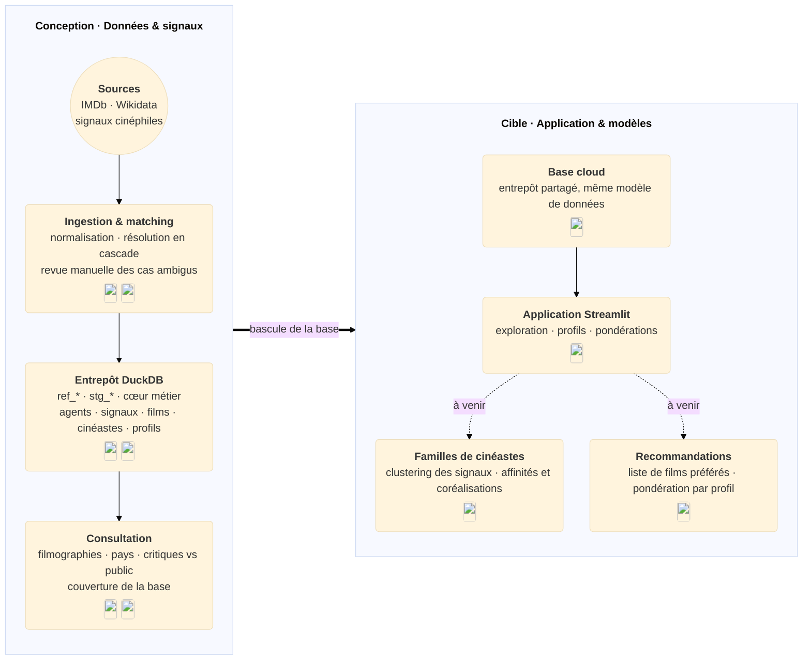
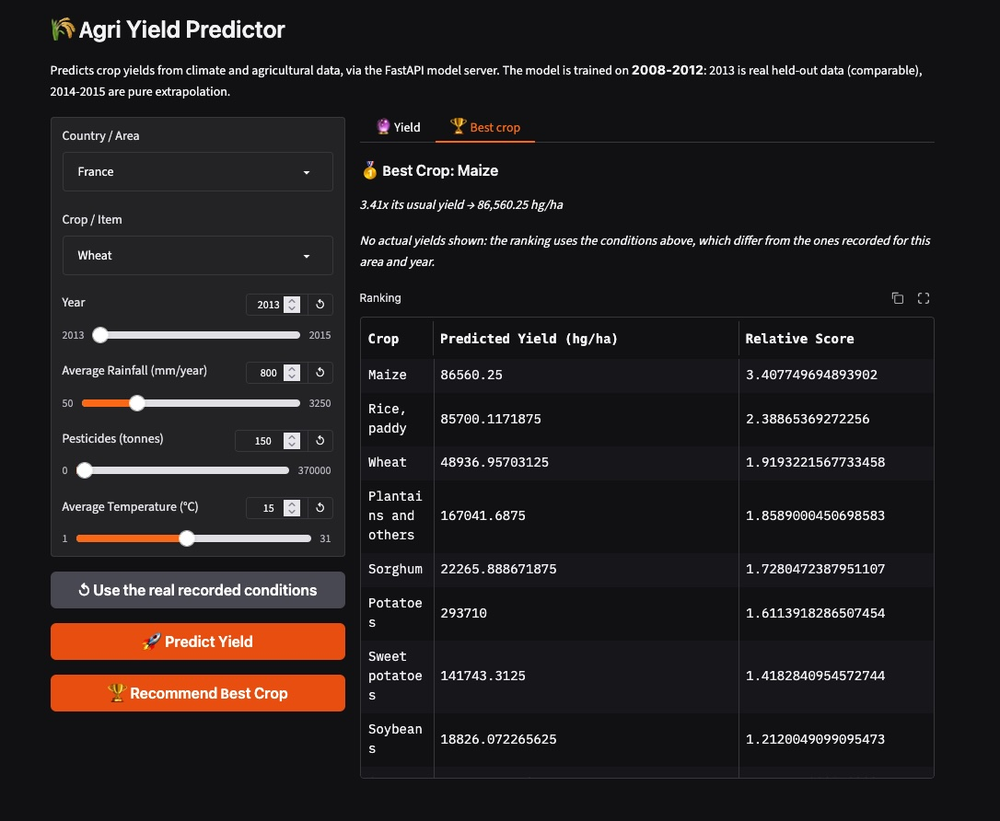
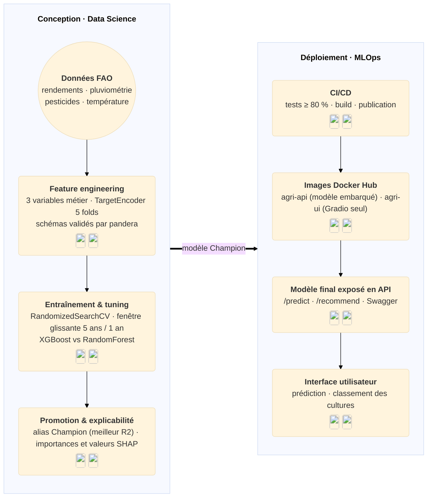
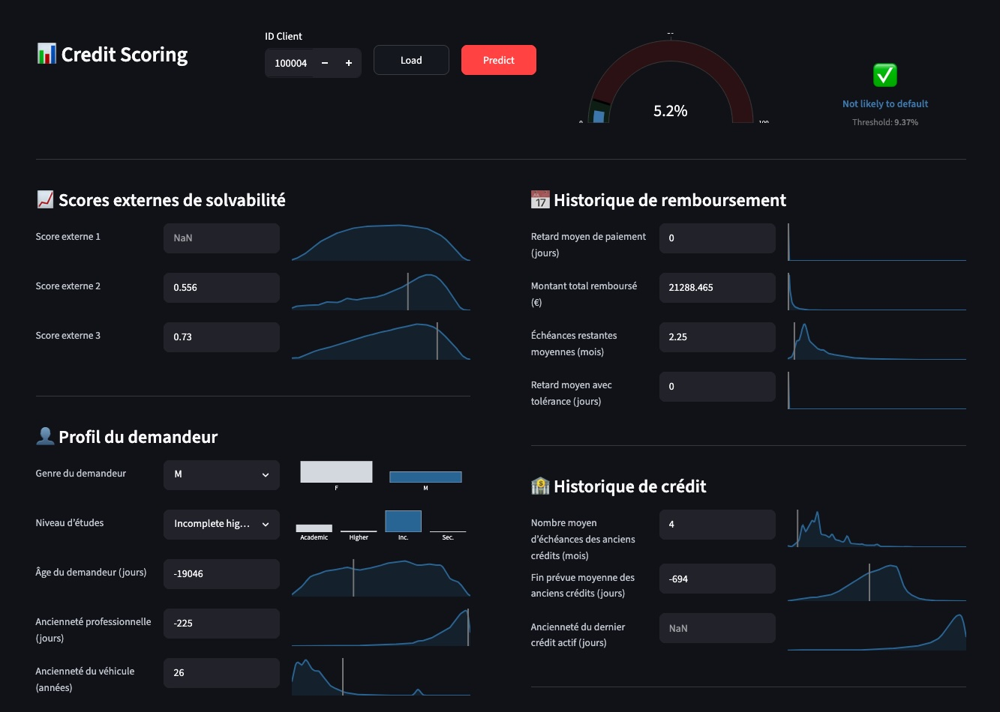
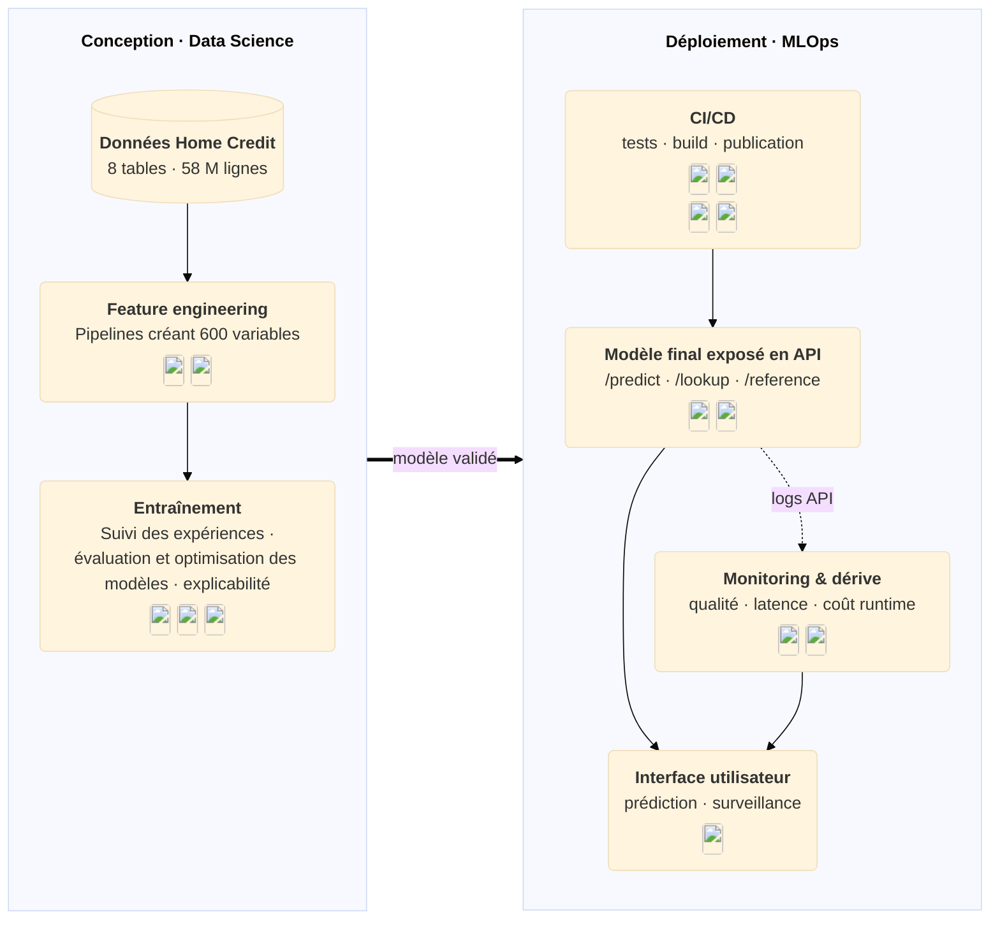
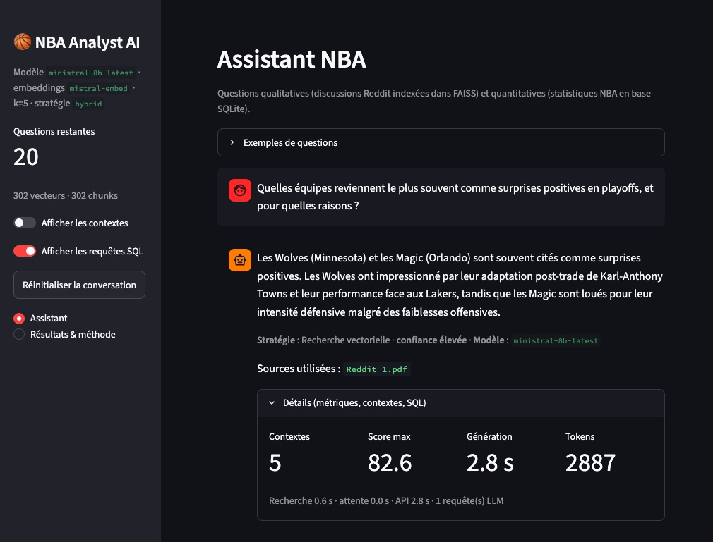
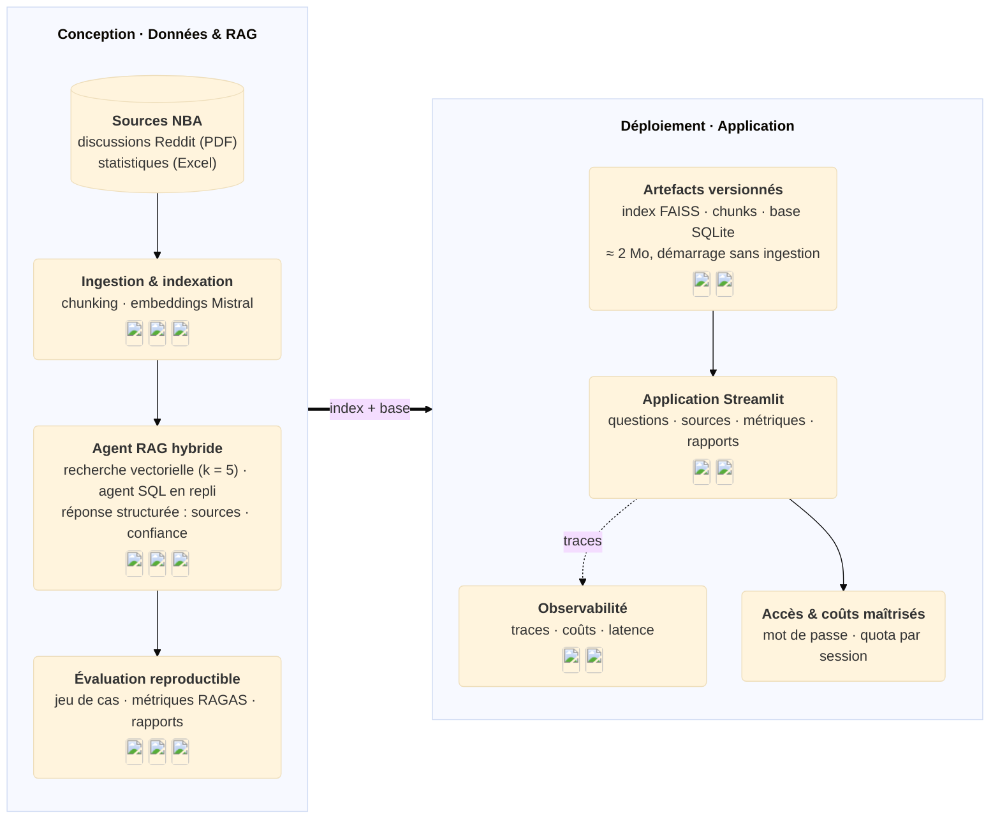

# Applications data & IA que j'ai développées

Quatre projets menés de la conception au déploiement : modélisation supervisée, industrialisation MLOps, entrepôts de données et applications LLM. Pour chacun, cette page présente l'**architecture cible** et les **technologies mobilisées** ; le détail des compétences est regroupé dans la page [Stack](03_stack.md).

Certains projets sont encore en construction : l'architecture décrite est alors l'architecture visée, pas un état livré.

| Projet | Type | En une phrase | Démo |
| :--- | :--- | :--- | :--- |
| **Cine** | Projet personnel, en construction | Base cinéma personnelle enrichie de signaux cinéphiles, puis profils pondérés et recommandations | *à venir* |
| **Agri** | Bootcamp MLOps, déployé | Prédiction et recommandation de rendements agricoles, de l'entraînement au service en ligne | [App](https://agri-ui-28873275232.europe-west1.run.app) |
| **Crédit** | Bootcamp MLOps, déployé | Prédiction du risque de défaut de remboursement et scoring manipulable par un métier | [App](https://huggingface.co/spaces/OlivierBinder/credit-scoring) |
| **Basket (llmeval)** | Bootcamp LLMOps, déployé | Assistant NBA augmenté par un RAG hybride, et mesure reproductible de ses réponses | [App](https://llmeval-nba.streamlit.app/) |

---

## :lucide-clapperboard: &nbsp; App Cinéma

**Projet personnel — en construction**

À destination des cinéphiles, ce projet construit une **base cinéma personnelle** à partir d'IMDb, enrichie de signaux de prescription — sélections de cinéastes, critiques, festivals, institutions, revues — pour explorer les films et les cinéastes, puis à terme produire des **recommandations personnelles** à partir d'une liste de films préférés. Le projet n'est pas terminé : ni démo publiée, ni dépôt public pour le moment, mais une interface Streamlit de consultation existe déjà en local.

**Parcours utilisateur (cible)**

- Mettre à jour les référentiels IMDb et importer un nouveau signal cinéphile
- Valider les correspondances ambiguës en zone de staging
- Explorer une filmographie, un cinéaste, un pays, une période ou un signal
- Comparer critiques et public, mesurer la couverture de la base
- Créer des profils cinéphiles et pondérer les signaux selon ses affinités
- Obtenir des recommandations à partir d'une liste de films préférés *(à venir)*

<strong>Architecture cible</strong>

Côté données, le projet sépare les **référentiels bruts** (`ref_*` : œuvres, personnes, contributeurs, notes IMDb, territoires), les **zones de staging** (`stg_*`) relues manuellement et le **cœur métier** consolidé. Tous les signaux partagent le même modèle, quel que soit leur émetteur : un **agent** (cinéaste, critique, revue, institution, festival, audience) applique une **valeur** — sélection classée ou non, distinction, note, mesure — à des films ou à des cinéastes, avec son périmètre (période, pays, genre, durée). L'intégration est semi-automatique : collecte, normalisation, résolution en cascade des titres et des noms, puis revue manuelle des cas ambigus avant chargement dans le cœur métier.

Côté technique, l'entrepôt est un **DuckDB** local organisé en miroir du code (`ref_*` / `stg_*` / cœur), avec des schémas de garde-frontière Pydantic et `pandera`, des recettes `just` par domaine et une interface **Streamlit** de consultation déjà amorcée (filmographies, cinéastes par pays, critiques face au public, couverture, correspondances à relire). La cible est de basculer la base sur **MotherDuck** afin de publier l'application sur un entrepôt cloud, sans changer le modèle de données.

La dernière brique reste à construire : le volet apprentissage. D'abord un **clustering** des signaux pour dégager des *familles de cinéastes* (affinités, coréalisations, proximités de goût), puis un moteur de **recommandation** qui, à partir d'une liste de films préférés, pondère les signaux selon le profil pour proposer des films.

Pour plus de détails, consultez la documentation technique du projet (locale pour l'instant : processus de référence, de signaux et d'enrichissement, modèle des signaux, dictionnaire des tables).

---

## :lucide-wheat: &nbsp; App Agriculture

À destination des acteurs agricoles, cette application prédit le **rendement d'une culture** à partir de données climatiques et agricoles — pluviométrie, pesticides, température — issues du dataset FAO, et **classe toutes les cultures** pour un contexte donné. [**Lien vers l'application**](https://agri-ui-28873275232.europe-west1.run.app) (cold start)

**Parcours utilisateur**

- Choix de la zone, de la culture et de l'année
- Réglage des conditions (pluviométrie, pesticides, température) ou reprise des conditions réellement enregistrées
- Prédiction du rendement de la culture sélectionnée
- Classement de toutes les cultures par score relatif, pour le même contexte
- Onglet par usage : prédiction ou recommandation, servis par l'API

<strong>Architecture de la solution</strong>

Côté conception, le pipeline part du dataset FAO et d'un **split par année** — 1990-2012 pour l'entraînement, 2013 en holdout — pour coller au cas d'usage réel : réentraîner chaque année et prédire l'année suivante. Le feature engineering ajoute trois variables métier (interaction pluie/température, efficacité de la pluie, écart à la température optimale de la culture), `Area` et `Item` sont encodés par un `TargetEncoder` validé en 5 folds, et les schémas d'entrée, de cible et de sortie sont contrôlés par `pandera`. Le tuning (`RandomizedSearchCV`, 30 combinaisons) s'appuie sur une validation glissante « 5 ans d'entraînement / 1 an de test » déroulée sur tout l'historique (17 folds) : la dérive temporelle des rendements rend les fenêtres courtes plus pertinentes, une fenêtre de 5 ans minimisant le RMSE (20 652 ± 1 306) contre 23 826 sur 20 ans. Le modèle final (`XGBoost`, baseline `RandomForest`) est entraîné sur les 5 dernières années, signé, enregistré dans le **MLflow Model Registry** puis promu par l'alias `Champion` (meilleur `R2_test`) ; importances et valeurs `SHAP` documentent ses décisions. Dernier run : `RMSE_test` ≈ 19 653 et `R2_test` ≈ 0,959 sur le holdout 2013.

Côté déploiement, deux images Docker indépendantes sont construites par la CI puis déployées sur **Google Cloud Run** (`europe-west1`, scale-to-zero) : `agri-api` embarque le modèle `Champion` (bundle exporté du registre, aucun registre MLflow au runtime) et expose `/predict` et `/recommend` avec sa [documentation Swagger](https://agri-api-28873275232.europe-west1.run.app/docs) ; `agri-ui` reste volontairement légère (Gradio seul, sans stack ML) et interroge l'API via `API_URL`. Déploiement par digest, authentification sans clé (Workload Identity Federation) et notification d'échec en fin de pipeline.

Pour plus de détails, consultez la [documentation technique](https://olivierbinder.github.io/agri/) et le [code](https://github.com/olivierbinder/agri) du projet.

---

## :lucide-piggy-bank: &nbsp; App Crédit

À destination d'organismes de crédit, cette application permet de prédire le **risque de défaut d'un demandeur** grace à un modèle de Machine Learning entraîné sur les données historiques des clients ayant honoré ou non leur remboursements. [**Lien vers l'application**](https://huggingface.co/spaces/OlivierBinder/credit-scoring) (cold start)

**Parcours utilisateur**

- Chargement des données clients
- Visualisation par rapport aux autres clients
- Prédiction du risque de défaut
- Surveillance de la dérive du modèle et des performances de calcul

<strong>Architecture de la solution</strong>

Côté conception, le feature engineering croise les 8 tables Home Credit et leurs 58 M de lignes —  historiques des demandes de crédits, échéances de remboursement et encours mensuels — pour aboutir à 600 variables, utilisées pour le benchmark des modèles. Les étapes de sélection de variables, d'évaluation et d'optimisation, suivies dans MLflow, ont permis d'obtenir notre modèle cible, dont les prédictions sont expliquées par SHAP.

Côté déploiement, la chaîne CI/CD teste, conteneurise le modèle optimisé au format ONNX et publie l'application sur Hugging Face Spaces : le modèle retenu est exposé via une API FastAPI, interrogée par une interface Streamlit qui intègre le suivi de la dérive des données et du coût d'exécution.

Pour plus de détails, consultez la [documentation technique](https://olivierbinder.github.io/Credit_scoring/) et le [code](https://github.com/olivierbinder/Credit_scoring) du projet.

---

## :lucide-whistle: &nbsp; App Basket

À destination des passionnés de NBA, cette application répond à des **questions pointues sur la saison** à partir de sources hétérogènes — discussions Reddit et statistiques structurées — grâce à un **RAG hybride** (recherche vectorielle et agent SQL), et **mesure la qualité de ses réponses** sur un jeu de cas de référence. [**Lien vers l'application**](https://llmeval-nba.streamlit.app/) (mot de passe à saisir : nbademo / cold start)

**Parcours utilisateur**

- Question libre ou choix d'un cas d'exemple
- Réponse sourcée, avec la stratégie mobilisée : recherche vectorielle ou requête SQL
- Niveau de confiance et signalement d'un contexte insuffisant
- Détail des contextes récupérés, des scores, de la latence et des tokens
- Consultation des rapports d'évaluation dans l'application

<strong>Architecture de la solution</strong>

Côté conception, l'ingestion unifie des sources hétérogènes — discussions Reddit (PDF) et statistiques NBA (Excel) — en deux socles : un **index vectoriel FAISS** alimenté par les embeddings Mistral, et une **base SQLite** des statistiques structurées. L'agent route ensuite chaque question : recherche vectorielle (`k = 5`) pour le qualitatif, agent SQL (requêtes `SELECT` et `WITH` uniquement, avec repli automatique sur le vectoriel) pour le chiffré. La réponse est structurée — texte, sources réellement utilisées, niveau de confiance, signalement d'un contexte insuffisant — et validée par un schéma Pydantic.

Côté évaluation, la qualité est mesurée sur un jeu de cas versionné (questions et réponses de référence en YAML) : exécution avec pydantic-evals, notation RAGAS sur quatre métriques, traces et coûts dans Logfire, rapports Markdown et CSV générés à chaque run pour comparer les versions du pipeline. Deux versions ont été comparées sur le même jeu de questions :

| Version | Stratégie | Faithfulness | Relevancy | Precision | Recall |
| :--- | :--- | ---: | ---: | ---: | ---: |
| `v0` | FAISS seul | 0,817 | 0,611 | 0,642 | 0,542 |
| `v1` | Hybride FAISS + SQL | **0,875** | **0,825** | **0,762** | **0,742** |

Le gain vient principalement des questions chiffrées : sur les cas traités réellement par SQL, la fidélité passe de 0,500 à 1,000 et le rappel de 0,000 à 1,000.

Côté déploiement, l'application Streamlit est publiée sur **Streamlit Community Cloud** depuis le dépôt : seuls l'index, les chunks et la base (≈ 2 Mo) sont versionnés, les dépendances de l'app sont isolées du reste du projet pour un build léger, et l'accès peut être protégé par mot de passe avec un quota de questions par session.

Pour plus de détails, consultez la [documentation technique](https://olivierbinder.github.io/llmeval/) et le [code](https://github.com/olivierbinder/llmeval) du projet (données, pipeline RAG, évaluation, résultats).

---

## :lucide-compass: &nbsp; Ce que ces projets couvrent

Pris ensemble, ils parcourent toute la chaîne : préparation et validation des données, entraînement et sélection de modèles, exposition d'un service, interface utilisateur, évaluation et surveillance, jusqu'à l'industrialisation des pipelines et à l'observabilité d'une application LLM. Le détail des outils et de leur niveau de maîtrise est dans la page [Stack](03_stack.md).
